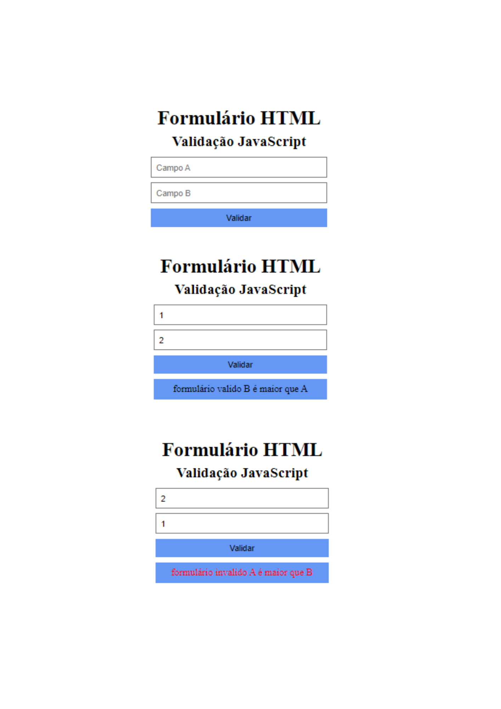

## Formulário HTML com validação JavaScript

### Atividade: Curso EBAC.
#### 1) Crie um formulário HTML que possua dois campos numéricos:
#### 2) Insira um botão para submeter o formulário
#### 3) Crie uma validação no JavaScript, na qual o formulário será válido caso o número B seja maior que o número A.
#### 4) Exiba uma mensagem positiva para o usuário quando o formulário for válido e uma mensagem negativa quando for inválido.
#### O formulário possui as seguintes validações:
- campo B maior que A
- campo A maior que B
- campos iguais
#### Para cada situação existe resposta diferente.

